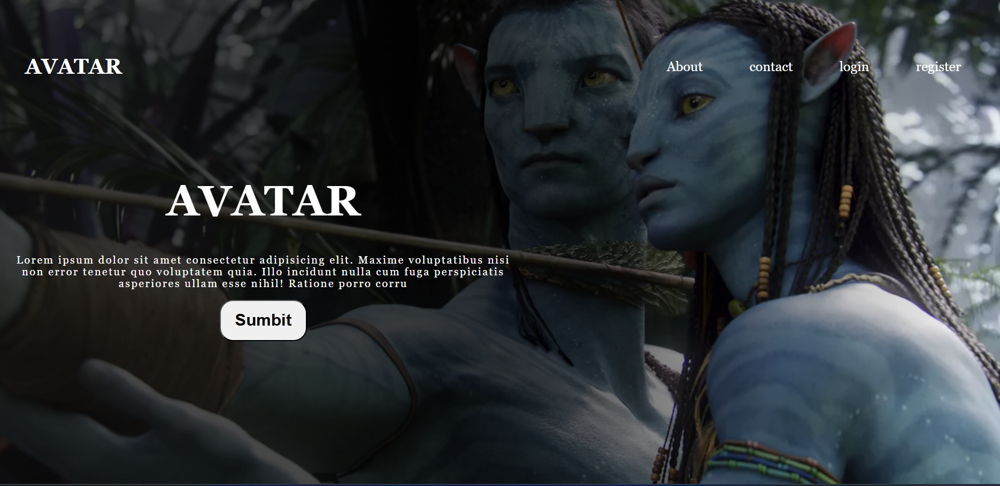

# 🌌 Avatar Website 🌌  
### ✨ A Modern & Stylish Landing Page ✨  



---

## 💡 About This Project  
Welcome to the **Avatar Website** — a sleek and minimal front-end design built with pure **HTML** and **CSS** 🖤.  
It features a stunning **gradient background**, responsive layout, and smooth hover transitions that bring the page to life! 🌈  

This project demonstrates the beauty of **simplicity and symmetry** in web design — no JavaScript, no frameworks, just clean code and creativity 💻✨  

---

## 🎨 Features  
✅ Elegant gradient background  
✅ Responsive layout for small screens  
✅ Animated hover effects for links & buttons  
✅ A clean, centered hero section  
✅ Custom font styling for a cinematic look 🎬  

---

## 🧠 Technologies Used  
- **HTML5** 🌐  
- **CSS3** 🎨  
- **Responsive Design (Media Queries)** 📱  

---

## 🚀 How to Run  
1. Clone the repo or download the ZIP:  
   ```bash
   git clone https://github.com/Basem0AlHersh123/Avatar-Website.git
````

2. Open the project folder in your editor 🧑‍💻
3. Run the file `index.html` in your browser 🌍
4. Enjoy the clean UI! ✨

---

## 📸 Preview

Below is a glimpse of the website 👇


---

## 🧑‍🎨 Author

**👨‍💻 Basem Al Hersh**

* 🔗 GitHub: [Basem0AlHersh123](https://github.com/Basem0AlHersh123)
* 💬 “Design is not just what it looks like — it’s how it feels.”

---

## ⭐ Support

If you like this project, please **give it a star ⭐** on GitHub — it helps a lot and motivates future designs 💪

---

### 🖤 Made with Passion, by Basem0AlHersh123 🖤

```

---

Would you like me to give you a **perfect repo name and short GitHub description** (for the top of the repo, not the README) too?  
For example:  
> 💀 The Avatar Website — A cinematic gradient landing page built with pure HTML & CSS 🎨  

I can craft that part as well if you want.
 
